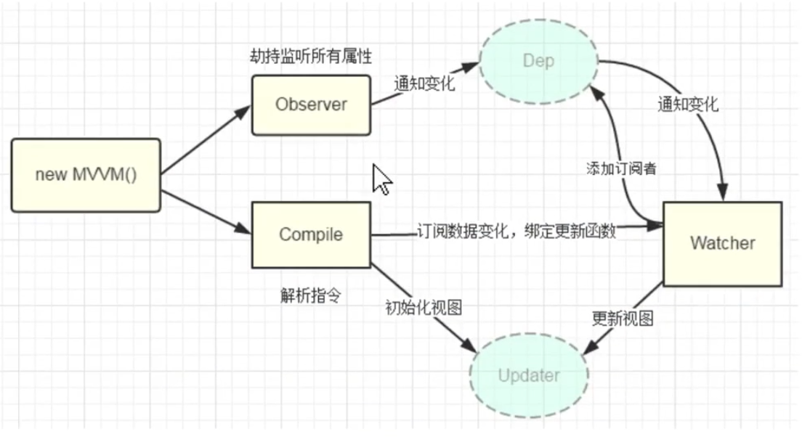

### 简易版 Vue 2.0，实现简单功能


- 响应式处理
- 编辑模板
- 简单指令
- 依赖收集




测试代码

```html
<!DOCTYPE html>
<html lang="en">
<head>
  <meta charset="UTF-8">
  <title>Title</title>
</head>
<body>
<div id="app">
  <p>{{counter}}</p>
  <p>{{counter}}</p>
  <p k-text="counter"></p>
  <p k-html="desc"></p>
</div>
<script src="./kvue.js"></script>
<script>
  const app = new Kvue({
    el: '#app',
    data: {
      counter: 1,
      desc: '<span style="color: red">lzw. 真棒</span>'
    }
  })
  setInterval(() => {
    app.counter++
  }, 1000)
</script>
</body>
</html>
```

简易版 Vue 2.0

```js
/**
 * 1、对 data 选项进行响应式处理
 * 2、编辑模板
 * 3、指令和事件
 * 4、依赖收集
 */
class Kvue {
  constructor(options) {
    this.$options = options
    this.$data = options.data
    // 响应式
    observe(this.$data)

    // 代理下
    proxy(this)

    // compile 编辑模板
    new Compile(options.el, this)
  }

}


// 数据响应式
function defineReactive(obj, key, val) {
  // 递归下，兼容 obj[key] = {a:10}
  observe(obj[key])

  // 创建 Key、Dep、Watcher 的依赖
  const dep = new Dep()

  Object.defineProperty(obj, key, {
    get() {
      console.log('get', key)
      // 依赖收集
      Dep.target && dep.addDep(Dep.target)
      return val
    },
    set(newVal) {
      if (newVal !== val) {
        console.log('set', key)
        // 如果 newVal 是对象，做响应式处理，比如 obj.key = {a:10}
        observe(newVal)
        val = newVal

        // watcher 更新
        // watchers.forEach(w => w.update())
        dep.notify()
      }
    }
  })
}

// 遍历 obj, 对所有属性做响应式
function observe(obj) {
  if (typeof obj !== 'object' || obj == null) {
    return
  }

  new Observer(obj)
}


// 代理，实现的目的 vm.$data.counter 可以通过 vm.counter 拿到
function proxy(vm) {
  Object.keys(vm.$data).forEach(key => {
    Object.defineProperty(vm, key, {
      get() {
        return vm.$data[key]
      },
      set(v) {
        vm.$data[key] = v
      }
    })
  })
}


// 根据不同类型做响应式处理
class Observer {
  constructor(value) {
    this.value = value

    if (Array.isArray(value)) {
      // todo
    } else {
      this.walk(value)
    }
  }

  walk(obj) {
    Object.keys(obj).forEach(key => {
      defineReactive(obj, key, obj[key])
    })
  }
}

// 解析模板，1、处理插值，2、处理指令和事件，3、以上两者的初始化和更新

class Compile {
  constructor(el, vm) {
    this.$vm = vm
    this.$el = document.querySelector(el)

    if (this.$el) {
      this.compile(this.$el)
    }
  }

  compile(el) {
    // 遍历 el 子节点，判断类型做相应的处理
    const childNodes = el.childNodes

    childNodes.forEach(node => {
      if (node.nodeType === 1) {
        // 元素
        // console.log('元素', node.nodeName)
        // 处理 指令和事件
        const attrs = node.attributes
        Array.from(attrs).forEach(attr => {
          // k-xxx="abc"
          const attrName = attr.name
          const exp = attr.value
          if (attrName.startsWith('k-')) {
            const dir = attrName.substring(2)
            this[dir] && this[dir](node, exp)
          }
        })
      } else if (this.isInter(node)) {
        // 文本 插值表达式
        // console.log('插值', node.textContent)
        this.compileText(node)
      }

      // 递归下
      if (node.childNodes) {
        this.compile(node)
      }
    })
  }

  // 高级函数执行 dir
  update(node, exp, dir) {
    // 1、初始化
    const fn = this[dir + 'Updater']
    fn && fn(node, this.$vm[exp])

    // 2、更新操作
    new Watcher(this.$vm, exp, function (val) {
      fn && fn(node, val)
    })
  }

  // 对应的 k-text 的指令
  text(node, exp) {
    // node.textContent = this.$vm[exp]
    this.update(node, exp, 'text')
  }

  textUpdater(node, value) {
    node.textContent = value
  }

  // 编译 {{xxx}}文本
  compileText(node) {
    // node.textContent = this.$vm[RegExp.$1]
    this.update(node, RegExp.$1, 'text')
  }

  // 对应的 k-html 的指令
  html(node, exp) {
    // node.innerHTML = this.$vm[exp]
    this.update(node, exp, 'html')
  }

  htmlUpdater(node, value) {
    node.innerHTML = value
  }

  // 是否插值表达式
  isInter(node) {
    return node.nodeType === 3 && /\{\{(.*)\}\}/.test(node.textContent)
  }
}

// 监督器：负责依赖更新，有多少个变量就有多少个 watcher
// const watchers = []

class Watcher {
  constructor(vm, key, updateFn) {
    this.vm = vm
    this.key = key
    this.updateFn = updateFn

    // watchers.push(this)
    Dep.target = this
    // 相当于调用了一次 key 的 get 方法进行依赖收齐
    this.vm[this.key]
    Dep.target = null
  }

  // 被 Dep 调用的
  update() {
    // 执行实际的更新操作
    this.updateFn.call(this.vm, this.vm[this.key])
  }
}

// 实现 Dep，有多少个 key 就有多少个 dep
class Dep {
  constructor() {
    this.deps = []
  }

  addDep(dep) {
    // 这里的 dep 其实就是 watcher
    this.deps.push(dep)
  }

  notify() {
    // 这里的 dep 其实就是 watcher
    this.deps.forEach(dep => dep.update())
  }
}
```
 
