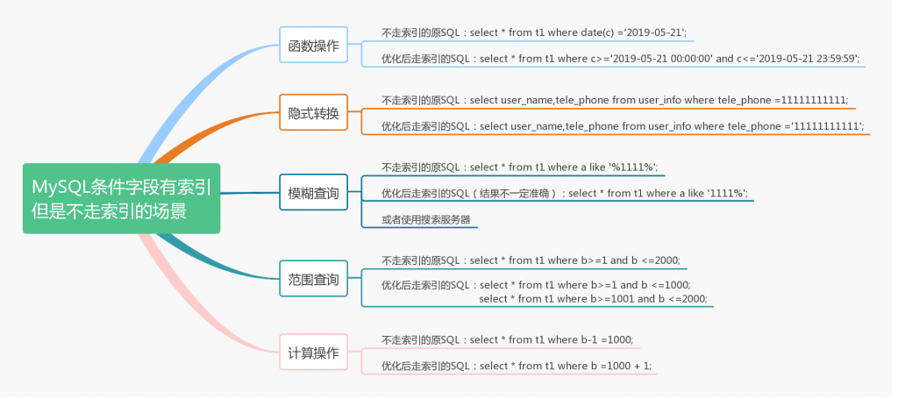

# MySQL总结常用优化问题

## 如何定位和分析慢 SQL

定位慢 sql 可以通过以下两种方式：

- 查看慢查询日志：tail mysql-slow.log
- 查看正在执行的 sql：show processlist

分析慢 sql 可以通过 explain， profile 和 trace 方式，三者各有其适用场景：

- explain select \* from t1 where id=1：获取 MySQL 中 sql 语句的执行计划，比如语句是否使用了关联查询、是否使用了索引、扫描行数等；
- show profiles：可以清楚了解到 sql 到底慢在哪个环节；
- SELECT \* FROM information\_schema.OPTIMIZER\_TRACE：查看优化器如何选择执行计划，获取每个可能的索引选择的代价。

通过 explain 分析慢 sql，explain 会返回很多字段，其中 select\_type、type、key、rows、Extra 是重点关注项。

## 存在索引但不能使用索引的场景



写 sql 语句时，应尽量注意以下几点

- 应该避免隐式转换
- like查询不能以%开头
- 范围查询时，包含的数据比例不能太大
- 不建议对条件字段做运算及函数操作

## 优化批量数据导入

一次插入多行的值；如：NSERT INTO `t1` VALUES (1,'1'), (2,'3')

关闭自动提交，多次插入数据的 SQL 一次提交；如：

``` js 
SET autocommit=0;
INSERT INTO `t1` VALUES (1,'1');
INSERT INTO `t1` VALUES (2,'2');
INSERT INTO `t1` VALUES (3,'3');
……
COMMIT;
```

调整参数，innodb\_flush\_log\_at\_trx\_commit 和 sync\_binlog 都设置为0（当然这种情况可能会丢数据）。有关的测试结果如下：

| innodb\_flush\_log\_at\_trx\_commit | sync\_binlog | TPS | 结论 |
| --- | --- | --- | --- |
| 1 | 1 | 316.83 | 双一情况写入速度最慢 |
| 1 | 0 | 526.97 |  |
| 0 | 1 | 497.42 |  |
| 0 | 0 | 2379.9 | 都设置为0的情况下，写入速度最快 |
| 2 | 1 | 515.76 |  |
| 2 | 0 | 2169.51 |  |

## 优化order by、group by查询

MySQL 根据索引情况有两种排序方式， 优先考虑索引排序 ：

- 通过有序索引直接返回有序数据
- 通过 Filesort 进行排序（通过查看explain分析 sql 中的Extra 字段）

而 Filesort 根据 sort\_buffer\_size 设置，优化器会选择两种排序方式， 优先考虑内存排序：

- 内存排序，当 “排序的数据大小” < sort\_buffer\_size
- 磁盘文件排序，当 “排序的数据大小” > sort\_buffer\_size，

Filesort 根据 max\_length\_for\_sort\_data 设置，优化器采用三种排序模式：

- < sort\_key, rowid > 双路（回表）排序， 当 “ 查询字段的总长度 ” <max\_length\_for\_sort\_data>
- < sort\_key, additional\_fields >单路排序，当 “ 查询字段的总长度 ” <max\_length\_for\_sort\_data>
- < sort\_key, packed\_additional\_fields >打包数据排序模式:与单路排序相似,区别是将 char 和 varchar 字段存到 sort buffe

**or**der by 语句的优化主要有：

- 通过添加合适索引
- 去掉不必要的返回字段
- 调整参数：主要是 max\_length\_for\_sort\_data 和 sort\_buffer\_size
- 避免无法利用索引排序的情况，如：使用范围查询再排序，asc和 desc 混合使用

group by 语句的优化，如果只要分组，没有排序需求的话，可以加 order by null 禁止排序。

## 分页查询优化场景

根据**自增且连续主键**排序的分页查询优化，如：

``` js 
select * from t1 limit 99000,2;
#优化后
select * from t1 where id >99000 limit 2;
```

查询**根据非主键字段**（a上有索引）排序的分页查询优化，如：

``` js 
select * from t1 order by a limit 99000,2;
#优化后
select * from t1 f inner join (select id from t1 order by a limit 99000,2)g on f.id = g.id;
```

## Join语句优化

MySQL 关联查询目前有三种算法：

- Nested-Loop Join 算法，当有索引时使用
- Block Nested-Loop Join 算法，当没有索引时，利用 join\_buffer 内存
- Batched Key Access 算法（MySQL 5.6新增），算是以上两种算法的结合，采用 join\_buffer 和 Multi-Range Read(MRR) 接口的方式

使用explain 分析 join 语句时，第一行是驱动表（默认小表作为驱动表，可以使用straight\_join 指定驱动表）；主要看被驱动表的执行计划 Extra 参数来判断采用哪种算法，所以主要的优化方式有：

- 通过关联字段添加索引
- 如无法在原表上加索引，可以创建临时表加索引
- 使用 straight\_join 指定小表作为驱动表，但是需要确定关联字段有索引

## 优化count(\*)查询

MyISAM 引擎执行 count() 比 InnoDB 引擎快， InnoDB 引擎（MySQL 5.7.18 之后）则使用二级索引来处理 count() 语句比使用主键索引处理 count() 效率更高， 按照效率排序的话，count(字段)<count(主键id)<count(1)≈count(_)，所以尽量使用count(_)。

几种优化 count() 的建议：

- show table status：能快速获取结果，但是结果不准确；
- 用 Redis 做计数器：能快速获取结果，比 show table status 结果准确，但是并发场景计数可能不准确；
- 增加 InnoDB 计数表：能快速获取结果，利用了事务特性确保了计数的准确，也是**比较推荐**的方法。

## B+ 树索引

B+ 树索引 发展过程：二分查找法 => 二叉查找树 => 平衡二叉树 => B 树 => B+ 树 => B+ 树索引。为什么 B+ 树索引这么快，主要是用到了聚集索引和辅助索引：聚集索引按照每张表的主键构造一颗B+ 数据，叶子节点存放整行数据；而辅助索引叶子节点只存放键值和主键ID。当通过辅助索引来寻找数据时,InnoDB 存储引擎会遍历辅助索引树查找到对应记录的主键索引来找到对应的行数据。

## 常见添加索引的场景

- 数据检索时在条件字段添加索引
- 聚合函数对聚合字段添加索引
- 对排序字段添加索引
- 为了防止回表添加索引
- 关联查询在关联字段添加索引
 
 
 
 
