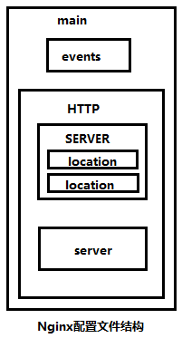

# Nginx 常用参数配置

nginx配置文件 `/usr/local/nginx/conf/nginx.conf` ， 四部分组成：main(全区设置)，server(主机配置)，upstream(负载均衡服务器设置)，和location(URL匹配特定位置设置)。



### 全局变量

``` js 
# 配置用户或者组，默认为nobody nobody。
#user www www;
 #Nginx开启的worker进程数，建议为CPU的核数
#worker_processes 2;
#指定nginx进程运行文件存放地址
#pid /nginx/pid/nginx.pid;
#指定日志路径，级别。这个设置可以放入全局块、http块、server块，级别以此为：debug|info|notice|warn|error|crit|alert|emerg
error_log log/error.log debug;
#可以在任意地方使用include指令实现配置文件的包含，类似于apache中的include方法，可减少主配置文件长度。
include vhosts/*.conf;
```

### 事件配置

``` js 
events {
    #use [ kqueue | rtsig | epoll | /dev/poll | select | poll ]; epoll模型是Linux 2.6以上版本内核中的高性能网络I/O模型，如果跑在FreeBSD上面，就用kqueue模型。
    use epoll;
    #每个进程可以处理的最大连接数，理论上每台nginx服务器的最大连接数为worker_processes*worker_connections。理论值：worker_rlimit_nofile/worker_processes
    #注意：最大客户数也由系统的可用socket连接数限制（~ 64K），所以设置不切实际的高没什么好处
    worker_connections  65535;
    #worker工作方式：串行（一定程度降低负载，但服务器吞吐量大时，关闭使用并行方式）
    multi_accept on;
}
```

### http参数

``` js 
http {
    #文件扩展名与文件类型映射表
    include mime.types;
    #默认文件类型
    default_type application/octet-stream;
    #日志相关定义
    #log_format  main  '$remote_addr - $remote_user [$time_local] "$request" '
    #                  '$status $body_bytes_sent "$http_referer" '
    #                  '"$http_user_agent" "$http_x_forwarded_for"';
    #定义日志的格式。后面定义要输出的内容。
    #1.$remote_addr 与$http_x_forwarded_for 用以记录客户端的ip地址；
    #2.$remote_user ：用来记录客户端用户名称；
    #3.$time_local ：用来记录访问时间与时区；
    #4.$request  ：用来记录请求的url与http协议；
    #5.$status ：用来记录请求状态；
    #6.$body_bytes_sent ：记录发送给客户端文件主体内容大小；
    #7.$http_referer ：用来记录从那个页面链接访问过来的；
    #8.$http_user_agent ：记录客户端浏览器的相关信息
    #access_log  logs/access.log  main; #连接日志的路径，指定的日志格式放在最后。
    error_log logs/error.log crit; #只记录更为严重的错误日志，减少IO压力
    #access_log  off; #关闭日志
    #默认编码
    #charset utf-8;
    #服务器名字的hash表大小
    server_names_hash_bucket_size 128;
    #客户端请求单个文件的最大字节数
    client_max_body_size 8m;
    #指定来自客户端请求头的hearerbuffer大小
    client_header_buffer_size 32k;
    #指定客户端请求中较大的消息头的缓存最大数量和大小。
    large_client_header_buffers 4 64k;
    #开启高效传输模式。
    sendfile on;
    #防止网络阻塞
    tcp_nopush on;
    tcp_nodelay on;
    #客户端连接超时时间，单位是秒
    keepalive_timeout 60;
    #客户端请求头读取超时时间
    client_header_timeout 10;
    #设置客户端请求主体读取超时时间
    client_body_timeout 10;
    #响应客户端超时时间
    send_timeout 10;
    #FastCGI相关参数是为了改善网站的性能：减少资源占用，提高访问速度。
    fastcgi_connect_timeout 300;
    fastcgi_send_timeout 300;
    fastcgi_read_timeout 300;
    fastcgi_buffer_size 64k;
    fastcgi_buffers 4 64k;
    fastcgi_busy_buffers_size 128k;
    fastcgi_temp_file_write_size 128k;
    #gzip模块设置
    gzip on;  #开启gzip压缩输出
    gzip_min_length 1k; #最小压缩文件大小
    gzip_buffers 4 16k; #压缩缓冲区
    gzip_http_version 1.0; #压缩版本（默认1.1，前端如果是squid2.5请使用1.0）
    gzip_comp_level 2; #压缩等级 1-9 等级越高，压缩效果越好，节约宽带，但CPU消耗大
    gzip_types text/plain application/x-javascript text/css application/xml; #压缩类型，默认就已经包含text/html，所以下面就不用再写了，写上去也不会有问题，但是会有一个warn。
    gzip_vary on; #前端缓存服务器缓存经过压缩的页面
} 
```

### 虚拟主机基本设置

``` js 
#虚拟主机定义
server {
    #监听端口
    listen       80;
    #访问域名
    server_name  localhost;
    #编码格式，若网页格式与此不同，将被自动转码
    #charset koi8-r;
    #虚拟主机访问日志定义
    #access_log  logs/host.access.log  main;
    #对URL进行匹配
    location / {
        #访问路径，可相对也可绝对路径
        root   html;
        #首页文件。以下按顺序匹配
        index  index.html index.htm;
    }
    #错误信息返回页面
    #error_page  404 /404.html;
    # redirect server error pages to the static page /50x.html
    error_page   500 502 503 504  /50x.html;
    location = /50x.html {
        root   html;
    }
    #访问URL以.php结尾则自动转交给127.0.0.1
    # proxy the PHP scripts to Apache listening on 127.0.0.1:80
    #location ~ .php$ {
    #    proxy_pass   http://127.0.0.1;
    #}
    #php脚本请求全部转发给FastCGI处理
    # pass the PHP scripts to FastCGI server listening on 127.0.0.1:9000
    #location ~ .php$ {
    #    root           html;
    #    fastcgi_pass   127.0.0.1:9000;
    #    fastcgi_index  index.php;
    #    fastcgi_param  SCRIPT_FILENAME  /scripts$fastcgi_script_name;
    #    include        fastcgi_params;
    #}
    #禁止访问.ht页面 （需ngx_http_access_module模块）
    # deny access to .htaccess files, if Apache's document root
    # concurs with nginx's one
    #location ~ /.ht {
    #    deny  all;
    #}
}
#HTTPS虚拟主机定义
server {
#    listen       443 ssl;
#    server_name  localhost;
#    ssl_certificate      cert.pem;
#    ssl_certificate_key  cert.key;
#    ssl_session_cache    shared:SSL:1m;
#    ssl_session_timeout  5m;
#    ssl_ciphers  HIGH:!aNULL:!MD5;
#    ssl_prefer_server_ciphers  on;
#    location / {
#        root   html;
#        index  index.html index.htm;
#    }
}
#vue配置
server {
    listen       80;
    server_name  jcsd-cdn-monitor.jdcloud.com;
    #charset koi8-r;
    #access_log  logs/host.access.log  main;
    root /root/dist;
    location / {
        try_files $uri $uri/ /index.html;
    }
    error_page   500 502 503 504  /50x.html;
    location = /50x.html {
        root   html;
    }
}
```

### Nignx状态监控

Nginx运行状态，StubStatus模块获取Nginx自启动的工作状态（编译时要开启对应功能）

``` js 
location /NginxStatus {
    #启用StubStatus的工作访问状态
    stub_status    on;
    #指定StubStaus模块的访问日志文件 可off
    access_log    logs/Nginxstatus.log;
    #Nginx认证机制（需Apache的htpasswd命令生成）
    #auth_basic    "NginxStatus";
    #用来认证的密码文件
    #auth_basic_user_file    ../htpasswd;
}
```

访问：[http://IP/NginxStatus(测试就不加密码验证相关)](http://IP/NginxStatus(测试就不加密码验证相关))

> active connections – 活跃的连接数量  
> server accepts handled requests — 总共处理了3个连接 , 成功创建3次握手, 总共处理了1个请求  
> reading — 读取客户端的连接数.  
> writing — 响应数据到客户端的数量  
> waiting — 开启 keep-alive 的情况下,这个值等于 active – (reading+writing), 意思就是 Nginx 已经处理完正在等候下一次请求指令的驻留连接.

### 反向代理

``` js 
#以下配置追加在HTTP的全局变量中
proxy_buffering on; #启动代理缓存功能
proxy_connect_timeout      5; #nginx跟后端服务器连接超时时间(代理连接超时)
proxy_send_timeout         5; #后端服务器数据回传时间(代理发送超时)
proxy_read_timeout         60; #连接成功后，后端服务器响应时间(代理接收超时)
proxy_buffer_size          16k; #设置代理服务器（nginx）保存用户头信息的缓冲区大小
proxy_buffers              4 32k; #proxy_buffers缓冲区，网页平均在32k以下的话，这样设置
proxy_busy_buffers_size    64k; #高负荷下缓冲大小（proxy_buffers*2）
proxy_temp_file_write_size 64k; #设定缓存文件夹大小，大于这个值，将从upstream服务器传
#反向代理缓存目录
proxy_cache_path /data/proxy/cache levels=1:2 keys_zone=cache_one:500m inactive=1d max_size=1g;
#levels=1:2 设置目录深度，第一层目录是1个字符，第2层是2个字符
#keys_zone:设置web缓存名称和内存缓存空间大小
#inactive:自动清除缓存文件时间。
#max_size:硬盘空间最大可使用值。
#指定临时缓存文件的存储路径(必须在同一分区)
proxy_temp_path /data/proxy/temp;
#服务配置
server {
    #侦听的80端口
    listen       80;
    server_name  localhost;
    location / {
        proxy_cache cache_one;#反向代理缓存设置命令(proxy_cache zone|off,默认关闭所以要设置)
        proxy_cache_valid 200 304 12h; #对不同的状态码缓存不同时间
        proxy_cache_key $host$uri$is_args$args;#设置以什么样参数获取缓存文件名
        proxy_set_header Host $host;#后端的Web服务器可以通过X-Forwarded-For获取用户真实IP
        proxy_set_header X-Real-IP $remote_addr;
        proxy_set_header X-Forwarded-For $proxy_add_x_forwarded_for;
        proxy_pass   http://IP; #代理设置
        expires    1d; #文件过期时间控制
    }
    #配置手动清楚缓存(实现此功能需第三方模块 ngx_cache_purge)
    #http://www.123.com/2017/0316/17.html访问
    #http://www.123.com/purge/2017/0316/17.html清楚URL缓存
    location ~ /purge(/.*) {
        allow    127.0.0.1;
        deny    all;
        proxy_cache_purge    cache_one    $host$1$is_args$args;
    }
    #设置扩展名以.jsp、.php、.jspx结尾的动态应用程序不做缓存
    location ~.*.(jsp|php|jspx)?$ {
        proxy_set_header Host $host;
        proxy_set_header X-Real-IP $remote_addr;
        proxy_set_header X-Forwarded-For $proxy_add_x_forwarded_for;
        proxy_pass http://IP;
    }
} 
```

### 负载均衡

``` js 
#负载均衡服务器池
upstream my_server_pool {
    #调度算法
    #1.轮循（默认）（weight轮循权值）
    #2.ip_hash：根据每个请求访问IP的hash结果分配。（会话保持）
    #3.fair:根据后端服务器响应时间最短请求。（upstream_fair模块）
    #4.url_hash:根据访问的url的hash结果分配。（需hash软件包）
    #参数：
    #down：表示不参与负载均衡
    #backup:备份服务器
    #max_fails:允许最大请求错误次数
    #fail_timeout:请求失败后暂停服务时间。
    server 192.168.1.109:80 weight=1 max_fails=2 fail_timeout=30;
    server 192.168.1.108:80 weight=2 max_fails=2 fail_timeout=30;
}
#负载均衡调用
server {
    ...
    location / {
    proxy_pass http://my_server_pool;
    }
}
```

### URL重写

``` js 
#根据不同的浏览器URL重写
if($http_user_agent ~ Firefox){
    rewrite ^(.*)$  /firefox/$1 break;
}
if($http_user_agent ~ MSIE){
    rewrite ^(.*)$  /msie/$1 break;
}
#实现域名跳转
location / {
    rewrite ^/(.*)$ https://web8.example.com$1 permanent;
}
```

### IP限制

``` js 
#限制IP访问
location / {
    deny 192.168.0.2；
    allow 192.168.0.0/24;
    allow 192.168.1.1;
    deny all;
}
```

### 部分参数详细说明

#### server\_name

``` js 
1.首先选择所有字符串完全匹配的server_name，如 blog.13sai.com 。
2.其次选择通配符在前面的server_name，如 *.13sai.com。
3.再次选择通配符在后面的server_name，如www.13sai.* 。
4.最后选择使用正则表达式才匹配的server_name，如 ~^.sai.com$
如果都不匹配
1、优先选择listen配置项后有default或default_server的
2、找到匹配listen端口的第一个server块
```

#### location

``` js 
location
语法: location[=|~|~*|^~|@]/uri/{...}
配置块: server location会尝试根据用户请求中的URI来匹配上面的/uri表达式，如果可以匹配，就选择 location{}块中的配置来处理用户请求。
```

location 表达式类型

``` js 
~ 表示执行一个正则匹配，区分大小写;
~* 表示执行一个正则匹配，不区分大小写;
^~ 表示普通字符匹配。使用前缀匹配。如果匹配成功，则不再匹配其他location;
= 进行普通字符精确匹配。也就是完全匹配;
@ 它定义一个命名的 location，使用在内部定向时，例如 error_page, try_files
```

优先级:

- 等号类型 (=) 的优先级最高。一旦匹配成功，则不再查找其他匹配项
- 前缀普通匹配 (^~) 优先级次之。不支持正则表达式。使用前缀匹配，如果有多个 location 匹配的话，则使用表达式最长的那个
- 正则表达式类型 (~ ~\*) 的优先级次之。一旦匹配成功，则不再查找其他匹配项
- 常规字符串匹配，如果有多个 location 匹配的话，则使用表达式最长的那个

> (location =) > (location 完整路径) > (location ^~ 路径) > (location ~,~\* 正则顺序) > (location 部分起始路径)

#### return

``` js 
语法:return code [text] return code URL;
return URL;
配置块:server，location，if
该指令用于结束规则的执行并返回状态吗给客户端。
状态码包括:
204(No Content)、
400(Bad Request)、
402(Payment Required)、
403(Forbidden)
404(Not Found)、
405(Method Not Allowed)、
406(Not Acceptable)、
408(Request Timeout)、
410(Gone)、
411(Length Required)、
413(Request Entity Too Large)、
416(Requested Range Not Satisfiable)、 500(Internal Server Error)、
501(Not Implemented)、
502(Bad Gateway)、
503(Service Unavailable)
504(Gateway Timeout)。
例如，示例，如果访问的URL以.sh .bash 结尾，返回状态码403
location ~ .*.(sh|bash)?$ {
    return 403;
}
```

#### rewrite

``` js 
执行顺序：
1. 执行server块的rewrite指令(这里的块指的是server关键字后{}包围的区域，其它xx块类似)
2. 执行location匹配
3. 执行选定的location中的rewrite指令
如果其中某步URI被重写，则重新循环执行1-3，直到找到真实存在的文件
如果循环超过10次，则返回500 Internal Server Error错误
语法:rewrite regex replacement [flag];
默认值:—
配置块:server, location, if
rewrite是实现URL重写的关键指令，根据regex(正则表达式)部分内容，重定向到replacement，结尾是flag标记。 正则:perl兼容正则表达式语句进行规则匹配
替代内容:将正则匹配的内容替换成replacement
flag标记:rewrite支持的flag标记
```

###### if 指令

``` js 
语法：if(condition){...}
默认值：无
配置块：server,location
对给定的条件condition进行判断。如果为真，大括号内的rewrite指令将被执行。
if条件(conditon)可以是如下任何内容:
一个变量名；false如果这个变量是空字符串或者以0开始的字符串；
使用= ,!= 比较的一个变量和字符串
是用~， ~*与正则表达式匹配的变量，如果这个正则表达式中包含}，;则整个表达式需要用" 或' 包围
使用-f ，!-f 检查一个文件是否存在
使用-d, !-d 检查一个目录是否存在
使用-e ，!-e 检查一个文件、目录、符号链接是否存在
使用-x ， !-x 检查一个文件是否可执行
```

###### if 实例

``` js 
if ($http_user_agent~*(mobile|nokia|iphone|ipad|android|samsung|htc|blackberry)) {
    rewrite ^.+ /mobile last; ＃跳转到手机站
}
if ($request_method = POST) {
    return 405;
}
if ($slow) {
    limit_rate 10k;
}
if ($invalid_referer) {
    return 403;
}
```

###### last & break

``` js 
（1）last 和 break 当出现在location 之外时，两者的作用是一致的没有任何差异。
注意一点就是，他们会跳过所有的在他们之后的rewrite 模块中的指令，去选择自己匹配的location
（2）last 和 break 当出现在location 内部时，两者就存在了差异
-- last: 使用了last 指令，rewrite 后会跳出location 作用域，重新开始再走一次刚刚的行为
-- break: 使用了break 指令，rewrite后不会跳出location 作用域。它的生命也在这个location中终结。
解释通俗易懂：
last：
        重新将rewrite后的地址在server标签中执行
break：
        将rewrite后的地址在当前location标签中执行
```

###### permanent & redirect:

``` js 
permanent: 永久性重定向。请求日志中的状态码为301
redirect:临时重定向。请求日志中的状态码为302
```

从实现功能的角度上去看，permanent 和 redirect 是一样的。不存在好坏。也不存在什么性能上的问题。但是对 seo 会有影响，这里要根据需要做出选择  
在 permanent 和 redirect 中提到了 状态码 301 和 302。

记住：last 和 break 想对于的访问日志的请求状态码为 200

当你打开一个网页，同时打开 debug 模式时，会发现 301 和 302 时的行为是这样的。

第一个请求 301 或者 302 后，浏览器重新获取了一个新的 URL ，然后会对这个新的 URL 重新进行访问。所以当你配置的是 permanent 和 redirect , 你对一个 URL 的访问请求，落到服务器上至少为 2 次；而当你配置了 last 或者是 break 时，你最终的 URL 确定下来后，不会将这个 URL 返回给浏览器，而是将其扔给了 fastcgi\_pass 或者是 proxy\_pass 指令去处理。请求一个 URL ，落到服务器上的次数就为 1 次。

注意：配置 last 在跨域的时候效果和 redirect 一致，都是返回 302 状态码，请求地址也发生改变

### 其他应用

#### 估算并发

nginx 作为 http 服务器的时候：

``` js 
max_clients = worker_processes * worker_connections/2
```

nginx 作为反向代理服务器的时候：

``` js 
max_clients = worker_processes * worker_connections/4 
```

#### 限制每个 IP 的并发连接数

demo: 定义一个叫 “two” 的记录区，总容量为 10M（超过大小将请求失败，以变量 $binary\_remote\_addr 作为会话的判断基准（即一个地址一个会话）。 限制 /download/ 目录下，一个会话只能进行一个连接。 简单点，就是限制 /download/ 目录下，一个 IP 只能发起一个连接，多过一个，一律 503。

``` js 
http {
    ...
    limit_conn_zone $binary_remote_addr zone=two:10m;
    server {
        ...
        location /download {
            limit_conn   two  1;
        }
    }
}
```

#### 限流

demo: 定义一个叫 “one” 的记录区，占用空间大小为 10m（超过大小将请求失败），平均处理的请求频率不能超过每秒一次，也可以设置分钟速率

``` js 
http {
    ...
    limit_req_zone  $binary_remote_addr  zone=one:10m  rate=1r/s;
    server {
        ...
        location / {
            #缓存区队列burst=5个,nodelay表示不延期(超过的请求失败)，即每秒最多可处理rate+burst个,同时处理rate个。
            limit_req zone=one burst=5 nodelay;
        }
    }
}
```

#### 白名单

``` js 
http{
    ...
    #判断客户端的ip地址是否在白名单列表当中,如果返回为0,则在白名单列表当中,否则返回为1
    geo $whiteIpList {
        default  1;
        118.24.109.254 0;
        47.98.147.0/24 1;
        #可以引入一些白名单配置
        include 'whiteIP.conf'
    }
    #如果不在白名单之内,返回客户端的二进制的ip地址
    map $whiteIpList  $limit {
        default  "";
        1   $binary_remote_addr;
        0   "";
    }
    #如果返回的是空字符串那么速率限制会失效
    limit_req_zone $limit zone=test:2m rate=1r/m;
    ...
}
```

#### 防盗链

``` js 
http {
    ...
    server {
        ...
        location ~* .(gif|jpg|png|swf|flv)$ {
            valid_referers none blocked *.13sai.com;
            if ($invalid_referer) {
                rewrite ^/ blog.13sai.com
            }
        }
    }
}
```

参考:

[https://learnku.com/articles/36768](https://learnku.com/articles/36768)

[https://www.jianshu.com/p/5d6bd48b4c2f](https://www.jianshu.com/p/5d6bd48b4c2f)
 
 
 
 
 
 
 
 
 
 
 
 
 
 
 
 
 
 
 
 
