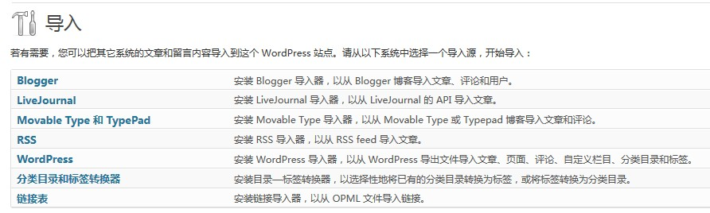

# WordPress导入测试数据(sample data)

做主题开发时希望有测试数据可以快速丰富WordPress，这样我们就可以对主题有比较好的把握，安装测试数据的步骤如下

1、下载测试数据[https://wpcom-themes.svn.automattic.com/demo/theme-unit-test-data.xml](https://wpcom-themes.svn.automattic.com/demo/theme-unit-test-data.xml)  
2、安装，找到WordPress后台的_工具（Tools）_\->_导入（Import）_，如下图所示，点击 _WordPress_ ，将自动安装该插件，插件安装完成后就会提示你上传源文件，此时将刚刚下载的xml文件上传即可。

3、安装时会有一些选项，比如问你是否要将导入源里的文章作者替换为当前WordPress里的作者，是否要将导入源里的附件下载到本地等，按照自己需要选择点击完成后，就可以拥有完整的WordPress测试数据了。

做主题测试时直接导入测试数据是个很好的选择。

原文：[https://www.solagirl.net/how-to-import-wordpress-sample-data.html](https://www.solagirl.net/how-to-import-wordpress-sample-data.html)
